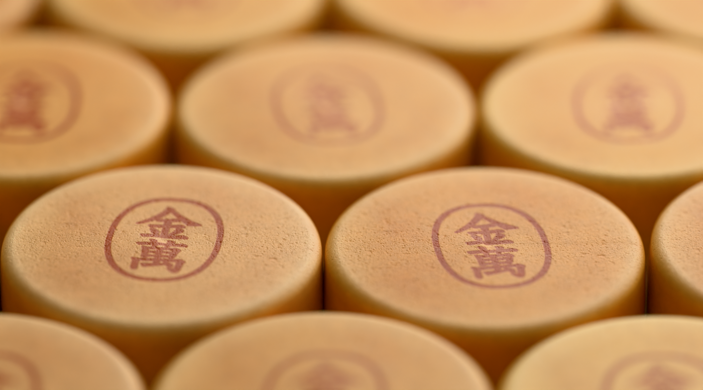
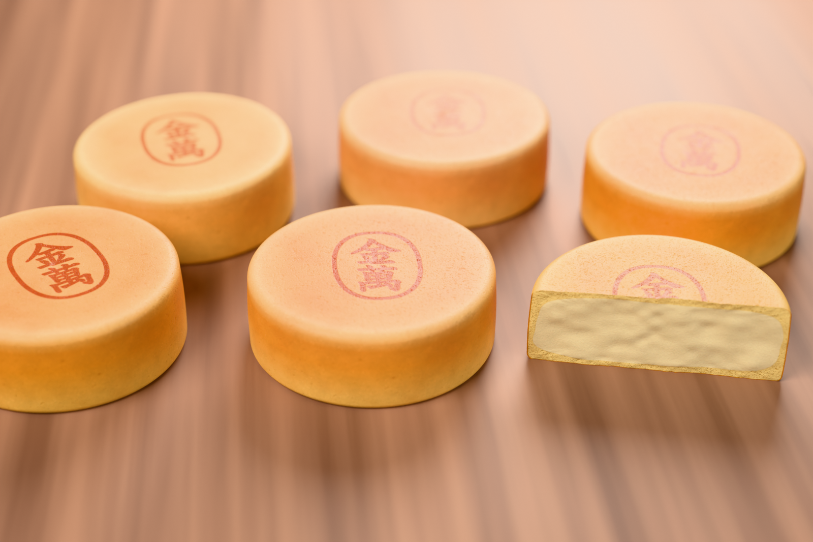

# 金萬 3D

秋田銘菓「金萬」を、好きな向きに回して眺められる 3D ビューアです（非公式のファンメイド）。

**公開ページ:** https://abs-mart.net/kinman-3d/





## 操作

- ドラッグ … どの向きにも回転（離すと惰性で回る）
- ホイール／ピンチ … 拡大縮小（2本指のひねりで画面内回転）
- 「斜め・真上・真横・底」… 向きの切り替え
- 「割ってみる」… 半分に割って断面（カステラ生地と玉子入り白あん）を見る
- ダブルクリック … 元の向きに戻す／矢印キーでも回転

## 構成

| パス | 内容 |
| --- | --- |
| `site/` | 公開ページ（three.js）。`models/kinman.glb` がモデル本体 |
| `blender/kinman_shape.py` | 形・UV 配置の定義（寸法、ゆがみ、あんの断面形、手で割った切り口のでこぼこ） |
| `blender/kinman_build.py` | Blender 内でメッシュを生成する（seed で個体差） |
| `blender/photo_setup.py` | 撮影用マテリアル（個体ごとに焼き色・焼き印の位置と濃さを変える） |
| `tools/gen_textures.py` | 色・粗さ・法線テクスチャ（4096px）を numpy で生成する。焼き印入り（サイト用）と焼き印なし（撮影用）の2組 |
| `make_stamp.py` | 焼き印のマスク画像を生成する（macOS の游教科書体を使用） |
| `renders/` | Blender（Cycles）での静止画 |

## 作り直すとき

```sh
python3 make_stamp.py            # textures/stamp_mask.png
python3 tools/gen_textures.py    # textures/kinman_{color,rough,normal}[_base].png
```

その後 Blender で `blender/kinman_build.py` を実行してメッシュを作り、テクスチャを貼って glTF（`site/models/kinman.glb`）に書き出します。
書き出しは KinmanExport シーン（KM_Whole・KM_HalfA・KM_HalfB を原点に置く）から、GLB・画像は WebP 品質 90・タンジェントあり。

## クレジット

- 環境光: [Studio Small 09](https://polyhaven.com/a/studio_small_09)（Poly Haven, CC0）
- 3D 表示: [three.js](https://threejs.org/)

本物の商品・ロゴとは関係のない、非公式のファンメイド作品です。焼き印の文字はシステムフォントで再現しています。
